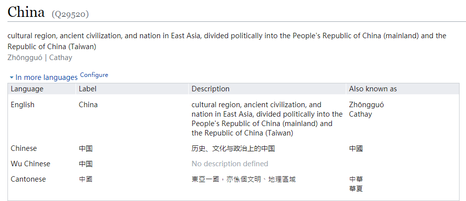
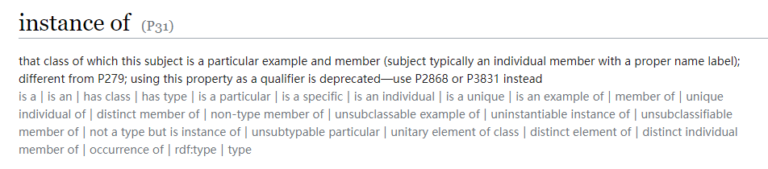
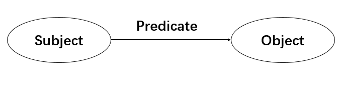
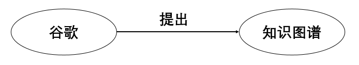

# RDFS简明入门

### IRI

在了解IRI之前，我们需要先了解URI。因为IRI在URI的基础上引入了Unicode字符以便支持非英文字符。

> 统一资源标识符（Uniform Resource Identifier，或URI)是一个用于标识某一互联网资源名称的字符串。 

在语义网络里，资源可以指代任何有形或者抽象的事物。

我们以wikidata为例。

 https://www.wikidata.org/wiki/Q29520 这一IRI指代的就是China这一实体




https://www.wikidata.org/wiki/Property:P31 这一IRI指代的是instance of这一概念




### RDF

RDF是W3C定义的一套用来描述实体的标准框架。全称为**Resource Description Framework**。

**实体**，又通常被称为**资源**。资源可以是我们定义的任何东西，比如说某个人，某个事物，甚至可以是抽象概念。

在RDF中，资源被描述为一个如下所述的RDF三元组，也可以被称为是一个带有属性和属性值的陈述。

```
[subject predicate object .]
```






RDF图由一系列的三元组组成。每个三元组表示为节点—弧线—节点的形式。在RDF中，节点分为三种类型。IRI或者IRIS，文字，空节点。更确切的来说，在RDF三元组中：

+ 主语可以是一个IRI或者空节点
+ 谓语应当是一个IRI
+ 宾语可以是一个IRI，文字或者空节点

RDF中的IRI是一个唯一标识资源的字符串。文字被用来表示字符串，数字和日期的值。


### RDFS

RDFS为RDF提供了一种简单的模式语言。并在RDF上增添了类和属性（**rdfs:Class/property**  ）。  

值域和定义域在属性上的约束以及子类和子属性的包蕴关系 （**rdfs:subClassOf, rdfs:subPropertyOf, rdfs:domain and rdfs:range: **）。

+ [C1 rdfs:subClassOf C2 .] 这表明C1是C2的子类，意味着所有C1类的实例全部都是C2类的实例。类似于集合中的子集关系。

  ```
  org:Non-GovOrganization rdsf:subClassOf org:Organization
  ```

+ [P1 rdfs:subPropertyOf P2 .]  这表明P1是P2的子属性，意味着所有P1的实例全部都是C2的实例。类似于集合中的子集关系。

  ```
  org:hasEnglishHonePage rdfs:subPropertyOf org:hasHomePage
  ```

+ [P domain C.]   这表明P的定义域是C。意味着C的每一个实例都拥有P这一属性。

  ```
  org:hasHomePage rdfs:domain org:Organization
  ```

+ [P range E.]  这表明P的值域是E。意味着P的每一个值都是E的一个实例。

  ```
  org:hasHomePage rdfs:range rdfs:Literal
  ```


### 参考书籍

[1]: 	"Exploiting Linked Data and Knowledge Graphs in Large Organisations"


